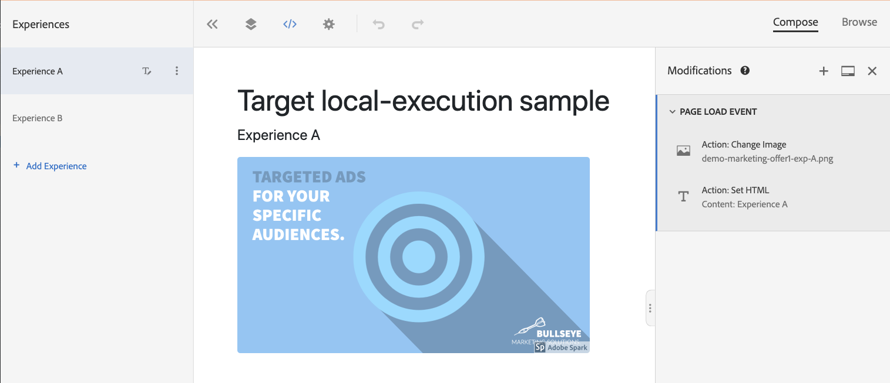
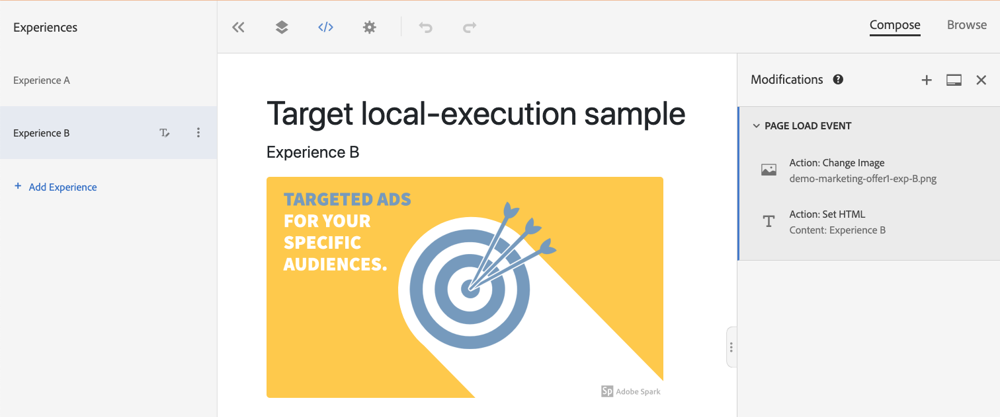

# Target Local execution VEC sample

## Overview

For this sample, we first created a simple AB activity using the Visual Experience Composer (VEC).  It has two experiences:

### Experience A


### Experience B



As you can see, each experience has a different paragraph text and image.

When the page is loaded in a browser, at.js makes an `execute>pageLoad` request automatically, and the appropriate content is shown.  But, rather than send a request to the target delivery API, at.js has been configured to use local execution mode to determine the outcome of the call. 

## Running the sample
1. Install dependencies: `npm i`
2. Start: `npm start`
3. Point a browser to http://127.0.0.1:3000


## How it works

This sample utilizes local execution mode to determine target experiences.  By default, at.js always makes a request to the target delivery API for each `getOffers` call.  But you can configure it to use local execution mode instead.  This mode downloads target activity rules on initialization.   The rules are then used to determine which experiences to return when `getOffers` is called, rather than make a request to the delivery API each time.

There are four main properties to keep in mind when using local execution mode:

| Name                      | Description                                                                         |
|---------------------------|-------------------------------------------------------------------------------------|
| executionMode             | The execution mode at.js will run in.  Can be `local`, `remote`, or `hybrid`. Defaults to `remote`      |
| artifactLocation          | This is a fully qualified url to the rules definition file that will be used to determine outcomes locally.  |
| artifactPayload           | A target decisioning JSON artifact. If specified, it is used instead of requesting one from a URL. |

```js
window.targetGlobalSettings = {
    executionMode: "local",
    artifactLocation: "assets/rules.json"
};

// at.js is loaded on the page and initialized 

// make getOffers requests
// adobe.target.getOffers(({...})
```

